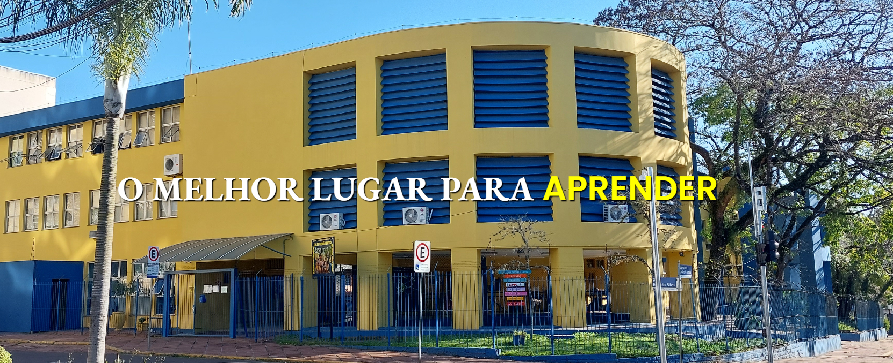
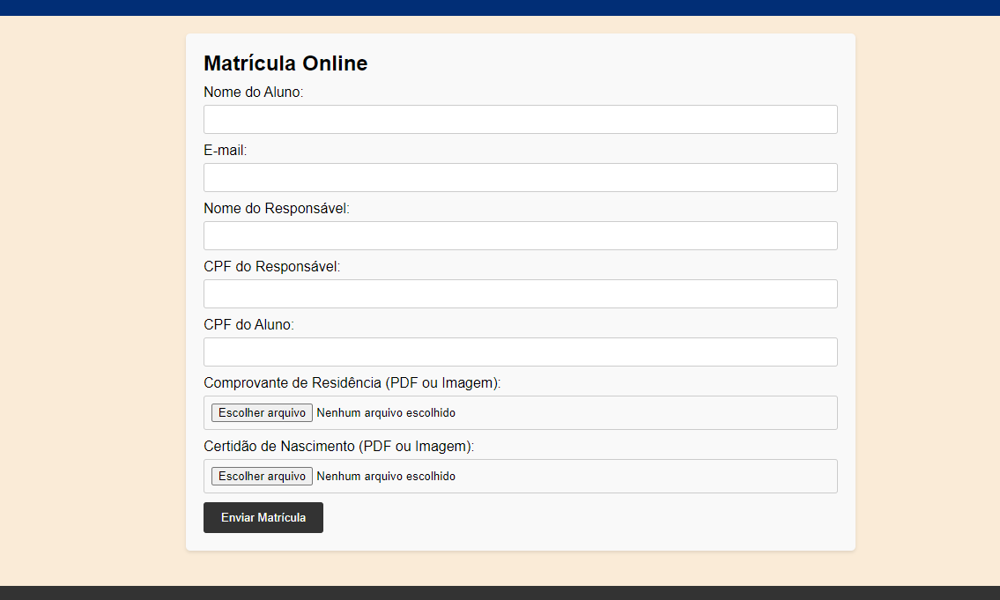
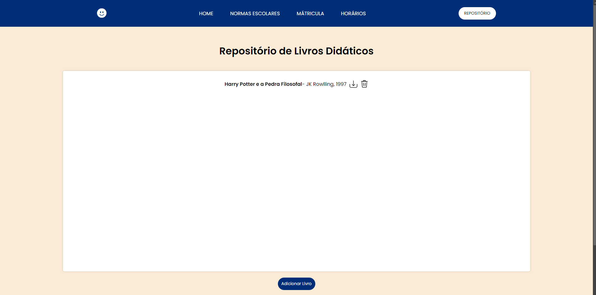
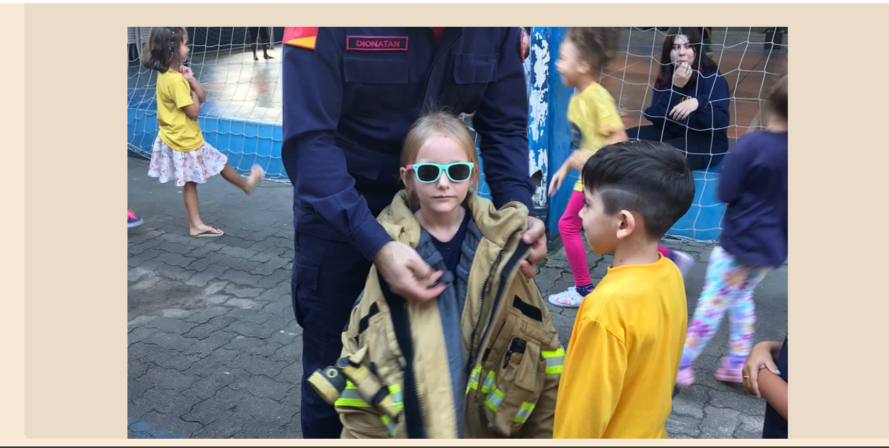

<h1>Gusmão</h1>
Esse projeto veio para suprir atividades escolares de forma mais fácil, ele é basicamente uma página que demonstra um pouco sobre a escola, como uma "landing page", mas não só isso.

<h2>Índice</h2>  

- [Sobre](#sobre)
- [Tecnologias](#tecnologias)

## Sobre

O intuito inicial do projeto foi ter algumas das coisas que uma escola real tem, porém de forma online. 
 
Como uma matrícula de alunos online;

Utilizando Forms, por conta de ser um projeto simples as informações da inscrição não são armazenadas em nenhum lugar.  

Um repositório de livros didáticos;  

Utilizando a sessionStorage para armazenar um JSON com os livros cadastrados de forma localmente.  

Uma galeria de fotos;  

um carrosel de fotos, com uma lógica em js usando ifs e fors normais.   

<strong>Tudo isso visando facilitar os processos padrões, e ajudar as pessoas da instituição.</strong>  

seus objetivos e motivações. Fale sobre o que o projeto faz, por que ele é útil, como ele é diferente de outras soluções, etc.

## Tecnologias

<table>
  <tr>
    <th>HTML</th>
    <th>CSS</th>
    <th>JavaScript</th>
  </tr>
  <tr>
    <td>53%</td>
    <td>34%</td>
    <td>11%</td>
  </tr>
</table>
